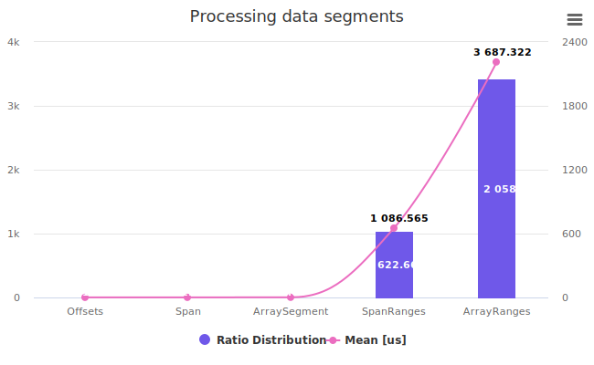

Have you ever wondered what happens behind the scenes when you use range expressions in C#? Range expressions are a convenient way to access a slice of an array or a span, using the syntax data[start..end]. For example, data[..1024] means the first 1024 elements of data, and data[1024..] means the rest of the elements.

Let's take a look at a few examples and run benchmarks. The results might be surprising.

<!--more-->

## Benchmark setup

We focus on a few typical approaches to passing data

```cs

[MemoryDiagnoser]
[MarkdownExporterAttribute.GitHub]
[CsvExporter]
[Orderer(SummaryOrderPolicy.FastestToSlowest, MethodOrderPolicy.Declared)]
public class Benchmark
{
    private const int KB = 1024;
    // 4 MB to fit single memory page
    private byte[] data = new byte[4 * KB * KB];


    [GlobalSetup]
    public void Setup()
    {
        new Random(42).NextBytes(data);
    }
    
    [Benchmark(Baseline = true)]
    public int Offsets() 
    {
        return  Utils.ComputeSum(data,0,KB)
              + Utils.ComputeSum(data,KB, KB)
              + Utils.ComputeSum(data,2*KB, KB)
              + Utils.ComputeSum(data,3*KB, KB);
    }

    [Benchmark]
    public int Span() 
    {
        return  Utils.ComputeSum(new Span<byte>(data, 0     , KB))
              + Utils.ComputeSum(new Span<byte>(data, KB    , KB))
              + Utils.ComputeSum(new Span<byte>(data, 2 * KB, KB))
              + Utils.ComputeSum(new Span<byte>(data, 3 * KB, KB));
    }

    [Benchmark]
    public int ArraySegment() 
    {
        var d = new ArraySegment<byte>(data);
        return  Utils.ComputeSum(d.Slice(0,KB))
              + Utils.ComputeSum(d.Slice(KB,KB))
              + Utils.ComputeSum(d.Slice(2*KB,KB))
              + Utils.ComputeSum(d.Slice(3*KB,KB));
    }

    [Benchmark]
    public int SpanRanges() 
    {
        Span<byte> d = data;
        return  Utils.ComputeSum(d[..KB])
              + Utils.ComputeSum(d[KB..(2*KB)])
              + Utils.ComputeSum(d[(2*KB)..(3 * KB)])
              + Utils.ComputeSum(d[(3*KB)..]);
    }
        
    [Benchmark]
    public int ArrayRanges() 
    {
        return  Utils.ComputeSum(data[..KB])
              + Utils.ComputeSum(data[KB..(2*KB)])
              + Utils.ComputeSum(data[(2*KB)..(3 * KB)])
              + Utils.ComputeSum(data[(3*KB)..]);
    }
}

```

:zap: The data processing code is intentionally oversimplified

```cs
public sealed class Utils
{
    public static int ComputeSum(Span<byte> chunk)
    {
        int sum = 0;
        foreach (var value in chunk)
            sum += value;

        return sum;
    }
    public static int ComputeSum(ArraySegment<byte> chunk)
    {
        int sum = 0;
        foreach (var value in chunk)
            sum += value;

        return sum;
    }
    public static int ComputeSum(IEnumerable<byte> chunk)
    {
        int sum = 0;
        foreach (var value in chunk)
            sum += value;

        return sum;
    }
    public static int ComputeSum(byte[] data, int start, int count)
    {
        int sum = 0;
        for (int i = 0; i < count; i++)
            sum += data[start + i];

        return sum;
    }
}

```

## Benchmark results

```text

BenchmarkDotNet v0.13.6, Windows 11 (10.0.22621.1992/22H2/2022Update/SunValley2)
AMD Ryzen 7 3800X, 1 CPU, 16 logical and 8 physical cores
.NET SDK 7.0.203
  [Host]     : .NET 7.0.5 (7.0.523.17405), X64 RyuJIT AVX2
  DefaultJob : .NET 7.0.5 (7.0.523.17405), X64 RyuJIT AVX2


```

|       Method |         Mean |    Ratio |     Gen0 |     Gen1 |     Gen2 | Allocated |
|------------- |-------------:|---------:|---------:|---------:|---------:|----------:|
|      Offsets |     1.771 μs |     1.00 |        - |        - |        - |         - |
|         Span |     1.941 μs |     1.10 |        - |        - |        - |         - |
| ArraySegment |     2.883 μs |     1.63 |        - |        - |        - |         - |
|   SpanRanges | 1,086.565 μs |   622.66 |        - |        - |        - |       1 B |
|  ArrayRanges | 3,632.562 μs | 2,050.90 | 332.0313 | 332.0313 | 332.0313 | 4194506 B |



<!-- generated with https://copyicon.com/generator/svg-column-line-chart -->

## Analysis

### Scenario 1 -  Data access using an offset and length

```cs
[Benchmark]
public int Offsets() 
{
  // ...
  Utils.ComputeSum(data,0,KB);
  //
}
```

Pros:

* :zap: The fastest way to access the data
* :+1: No compiler magic happens behind the scenes
* :+1: No pressure on garbage collection system - Zero allocations

Cons:

* :-1: Low-level approach hence tends to be  more verbose and error-prone
* :-1: Non-declarative and more difficult to maintain
* :-1: No abstraction of sequential memory

|       Method |         Mean |    Ratio |     Gen0 |     Gen1 |     Gen2 | Allocated |
|------------- |-------------:|---------:|---------:|---------:|---------:|----------:|
|      Offsets |     1.771 μs |   `1.00` |        - |        - |        - |         - |

### Scenario 2 -  Span&lt;T&gt; over a section of an array

```cs
[Benchmark]
public int Span() 
{
  // ...
  Utils.ComputeSum(new Span<byte>(data, 0     , KB));
  //
}
```

Pros:

* :+1: Fast! Only marginally slower than the raw access to the array
* :+1: No compiler magic happens behind the scenes
* :+1: No pressure on garbage collection system - Zero allocations
* :+1: Abstract away random access sequantial chunk of memory
* :+1: Supports fast and ergonomic code on the processing side
* :+1: Reduces code verbosity and improves consistency.

Cons:

* :-1: Requires `.net standard 2.1`

|       Method |         Mean |    Ratio |     Gen0 |     Gen1 |     Gen2 | Allocated |
|------------- |-------------:|---------:|---------:|---------:|---------:|----------:|
|         Span |     1.941 μs |   `1.10` |        - |        - |        - |         - |

### Scenario 3 -  ArraySegment&lt;T&gt; over a section of an array

```cs
[Benchmark]
public int ArraySegment() 
{
    var d = new ArraySegment<byte>(data);
    return  Utils.ComputeSum(d.Slice(0,KB))
          + Utils.ComputeSum(d.Slice(KB,KB))
          // ...
}
```

Pros:

* :+1: Fast! Only marginally slower than the raw access to the array
* :+1: No compiler magic happens behind the scenes
* :+1: No pressure on garbage collection system - Zero allocations
* :+1: Supports all versions of .net standard
* :+1: Supports fast and ergonomic code on the processing side
* :+1: Reduces code verbosity and improves consistency.

Cons:

* :-1: Leaking abstraction of the underlying array
* :-1: Pre _Nullable&lt;T&gt; types_ API  might require usage of the `null forgiving` operator in your code


|       Method |         Mean |    Ratio |     Gen0 |     Gen1 |     Gen2 | Allocated |
|------------- |-------------:|---------:|---------:|---------:|---------:|----------:|
| ArraySegment |     2.883 μs |   `1.63` |        - |        - |        - |         - |


### Scenario 4 -  Span&lt;T&gt; and a range expression

```cs
[Benchmark]
public int SpanRanges() 
{
    Span<byte> d = data;
    return  Utils.ComputeSum(d[..KB])
          + Utils.ComputeSum(d[KB..(2*KB)])
}
```

:boom: Surprise :boom: benchmark shows `x 622.66`  slowdown ratio relative to the baseline.
|       Method |         Mean |    Ratio |     Gen0 |     Gen1 |     Gen2 | Allocated |
|------------- |-------------:|---------:|---------:|---------:|---------:|----------:|
|   SpanRanges | 1,086.565 μs | `622.66` |        - |        - |        - |       1 B |

Analysis:

A compiler translates the syntax sugar above into the following code.

```cs
[Benchmark]
public int SpanRanges() 
{
    Span<byte> d = data;
    return  Utils.ComputeSum(d.Slice(0,1024)
          + Utils.ComputeSum(d.Slice(1024, 1024))
}
```

As you can see below, there is nothing in this code except _boundaries check_ when the internal unmanaged `_reference` handle is accessed. **I speculate that this is the main reason for the slowdown**. You can read more information about this method [here](https://learn.microsoft.com/en-us/dotnet/api/system.runtime.compilerservices.unsafe.add?view=net-7.0)  

```cs
// System.Private.CoreLib, Version=7.0.0.0,
// Culture=neutral, PublicKeyToken=7cec85d7bea7798e
// System.Span<T>

using System.Runtime.CompilerServices;
[MethodImpl(MethodImplOptions.AggressiveInlining)]
public Span<T> Slice(int start, int length)
{
	if ((ulong)((long)(uint)start + (long)(uint)length) > (ulong)(uint)_length)
	{
    		ThrowHelper.ThrowArgumentOutOfRangeException();
	}
	return new Span<T>(ref Unsafe.Add(ref _reference, 
                                    (nint)(uint)start), length);
}

```

### Scenario 5 -  range expression over arrays

> :warning: **Warning**
> This is the slowest and the least efficient way to access the data

```cs
[Benchmark]
public int ArrayRanges() 
{
    return  Utils.ComputeSum(data[..KB])
          + Utils.ComputeSum(data[KB..(2*KB)])
    // ...
}
```

This syntactic sugar is designed to make things easier to read or to express the data access pattern. But without proper support from the collection, it will lead to a performance disaster. It is expended into the call to the method `public static T[] GetSubArray<T>(T[] array, Range range)` of the class `System.Runtime.CompilerServices.RuntimeHelper`

Essentially, the snippet above is equivalent to the following:

```cs
[Benchmark]
public int ArrayRanges() 
{
    return Utils.ComputeSum(RuntimeHelpers.GetSubArray(data, ..1024))
           + Utils.ComputeSum(RuntimeHelpers.GetSubArray(data, 1024..2048))
          // ...
}
```

As you can see, the range expressions are replaced by calls to GetSubArray with the same range arguments. This means that every time you use a range expression, you create a new memory array, which may have some performance implications. If you want to avoid this overhead, you can use spans instead of arrays, lightweight references to a contiguous memory region. Spans support range expressions natively without creating new objects.

The memory allocation pattern is visible in the decompiled source code below.

```cs

// System.Private.CoreLib, Version=7.0.0.0, Culture=neutral,
// PublicKeyToken=7cec85d7bea7798e
// System.Runtime.CompilerServices.RuntimeHelpers
using System.Runtime.InteropServices;

public static T[] GetSubArray<T>(T[] array, Range range)
{
 //...

 T[] array2 = new T[num];
 
 Buffer.Memmove(ref MemoryMarshal.GetArrayDataReference(array2), 
                ref Unsafe.Add(
                    ref MemoryMarshal.GetArrayDataReference(array), 
                        elementOffset), (UIntPtr)(uint)num);
 return array2;
}


```

Pros:

* :+1: It makes reading or expressing the data access pattern easier.
* :+1: Supports fast and ergonomic code on the processing side


Cons:

* :-1: Creates GC pressure!  
* :-1: :boom: **Might not be sutable for high performance scenarios**.
* :-1: Since the memory segments were larger than 78KB, the memory was allocated using the large object heap and was subject of `Gen2` garbage collection. In other words, this is a well-known antipattern.
* :-1: :boom: Three orders of magnitude slower than the baseline approach

|       Method |         Mean |    Ratio |     Gen0 |     Gen1 |     Gen2 | Allocated |
|------------- |-------------:|---------:|---------:|---------:|---------:|----------:|
|  ArrayRanges | `3,632.562` μs | `2,050.90` | 332.0313 | 332.0313 | 332.0313 | 4194506 B |


## Conclusion

In conclusion, range expressions are a useful feature of C# that allows you to access slices of arrays or spans with a concise and readable syntax. However, they also rely on a helper method that creates new arrays under the hood, which may affect your performance. To optimize your code, you can use spans instead of arrays when possible, or avoid using range expressions in performance-critical scenarios.
