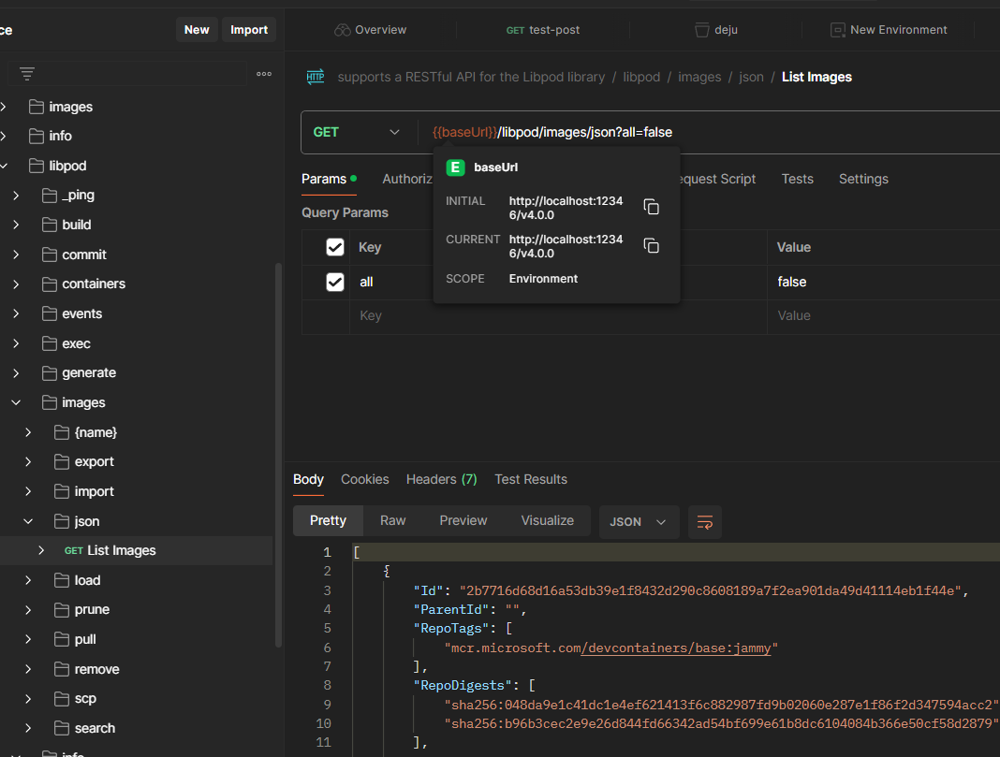

If you are looking for a way to manage containers without a daemon, Podman APIs are the perfect solution for you. Podman APIs allow you to create, run, and manage containers using a simple RESTful interface. You can use Podman APIs with any programming language that supports HTTP requests, such as Python, Ruby, or Go. In this post, I will show you how to get started with Podman APIs in a few easy steps.

My project involved creating a software system that uses the Podman engine as the core component for running containerized workflows. The engine is fully abstracted away from the user by the backend service, which communicates with it through unix domain sockets and Podman APIs.

## Introduction

Podman is a great alternative to Docker if you want to run containers and pods without a daemon. It offers a suite of tools, services and sdks that are compatible with the Docker CLI or the Kubernetes API. Podman is fast, secure and lightweight, and it supports Windows WSL v2. However, the documentation is not very clear or comprehensive and you might need some trial and error to figure things out. In this article, I will show you how to install podman on Ubuntu 22.04 image, using windows WSL v2. By the end of this tutorial, you will be able to use podman engine for your application development.

## Step 1: podman setup and configuration

* Update the System: Update your system packages using the `sudo apt update` command.
* Install Podman: Install Podman by running the command `sudo apt -y install podman`. You can verify the installation with the command `podman -v`.
* Initialize Podman: Initialize rootless Podman by executing `podman info`.
* Configure Podman Registry: By default, the Podman registry is not configured to download and install container images from the web. You need to configure it first. You can look at the Podman registry configuration file with the command `sudo vi -R /etc/containers/registries.conf`. I prefer the simple drag and drop approach to messing up with the default configuration files; hence let's add the following line to a new file `default-podman.conf` and drop the file into the `/etc/containers/registries.conf.d` folder.

```yaml
# file default-podman.conf
unqualified-search-registries = ["registry.fedoraproject.org", "registry.access.redhat.com", "quay.io", "registry.redhat.io", "docker.io"]
```

```sh
sudo ls -lR /etc/containers/
/etc/containers/:
total 20
-rw-r--r-- 1 root root 5001 Jan 23  2022 libpod.conf
-rw-r--r-- 1 root root   92 Dec 22  2021 policy.json
-rw-r--r-- 1 root root 3801 Aug 25  2021 registries.conf
drwxr-xr-x 2 root root 4096 Feb 29 16:25 registries.conf.d

/etc/containers/registries.conf.d:
total 8
-rw-r--r-- 1 root root  139 Feb 29 16:25 defaul-podman.conf
-rw-r--r-- 1 root root 3422 Dec 22  2021 shortnames.conf
```

Let's check if the prefix based lookup works by executing `podman search httpd`

The results should be similar to the table below

|INDEX            |NAME                                                                       |DESCRIPTION                                    |STARS         |OFFICIAL        |AUTOMATED   |FIELD7     |FIELD8    |FIELD9      |FIELD10           |FIELD11|FIELD12|FIELD13|
|-----------------|---------------------------------------------------------------------------|-----------------------------------------------|--------------|----------------|------------|-----------|----------|------------|------------------|-------|-------|-------|
|fedoraproject.org|registry.fedoraproject.org/f29/httpd                                       |0                                              |              |                |            |           |          |            |                  |       |       |       |
|redhat.com       |registry.access.redhat.com/rhscl/httpd-24-rhel7                            |Apache                                         |HTTP          |2.4             |Server      |0          |          |            |                  |       |       |       |
|redhat.com       |registry.access.redhat.com/cloudforms46/cfme-openshift-app                 |Red                                            |Hat®          |CloudForms      |Appliance   |image      |to        |be          |u...              |0      |       |       |
|quay.io          |quay.io/fedora/httpd-24                                                    |0                                              |              |                |            |           |          |            |                  |       |       |       |
|quay.io          |quay.io/tike/openshift-sp-httpd                                            |This                                           |is            |the             |httpd       |half       |of        |an          |Openshift-ready...|0      |       |       |
|redhat.io        |registry.redhat.io/rhscl/httpd-24-rhel7                                    |Apache                                         |HTTP          |2.4             |Server      |0          |          |            |                  |       |       |       |
|redhat.io        |registry.redhat.io/rhel8/httpd-24                                          |Apache                                         |HTTP          |Server          |2.4         |available  |as        |containe... |0                 |       |       |       |

## Step 2: podman API service configuration

To use Podman, you need to start the podman system service first. This service listens for API calls from Podman clients and runs them on Linux systems. You can use `systemd` to run this service automatically. 

* Let's check the id of my current user

```sh
mike@mpwk1:~$ id
uid=1000(mike) gid=1000(mike) groups=1000(mike),4(adm),20(dialout),24(cdrom),25(floppy),27(sudo),29(audio),30(dip),44(video),46(plugdev),116(netdev)
```

* Start the service as the user service `systemctl --user start podman.socket`
* `systemctl --user status` check that the service is running as expected

The results should look like the following: _you can see the podman is listening to the socket of the user with the id `1000`_

```sh
mike@mpwk1:~$ systemctl --user status
● mpwk1
    State: running
     Jobs: 0 queued
   Failed: 0 units
    Since: Thu 2024-02-29 13:46:30 EST; 5h 42min ago
   CGroup: /user.slice/user-1000.slice/user@1000.service
           ├─app.slice
           │ └─podman.service
           │   ├─567 /usr/bin/podman
           │   └─623 /usr/bin/dbus-daemon --syslog --fork --print-pid 4 --print-address 6 --session
           └─init.scope
             ├─509 /lib/systemd/systemd --user
             └─510 (sd-pam)
```

* Configure the systemd socket to be automatically started after reboots, and run as the specified user.

```sh
systemctl --user enable podman.socket
loginctl enable-linger mike
```

* Check that unix domain socket is exposed to this user

```sh

ls -l  /$XDG_RUNTIME_DIR/podman/podman.sock
# and the output is as expected
srw-rw---- 1 mike mike 0 Feb 29 13:46 //run/user/1000//podman/podman.sock
```

* the last step would be to try to connect the socket

```sh 

curl --unix-socket /run/user/1000/podman/podman.sock -v 'http://d/v4.0.0/libpod/info' | jq
*   Trying /run/user/1000/podman/podman.sock:0...
  % Total    % Received % Xferd  Average Speed   Time    Time     Time  Current
                                 Dload  Upload   Total   Spent    Left  Speed
  0     0    0     0    0     0      0      0 --:--:-- --:--:-- --:--:--     0* Connected to d (/run/user/1000/podman/podman.sock) port 80 (#0)
> GET /v4.0.0/libpod/info HTTP/1.1
> Host: d
> User-Agent: curl/7.81.0
> Accept: */*
>
* Mark bundle as not supporting multiuse
< HTTP/1.1 200 OK
< Api-Version: 1.40
< Content-Type: application/json
< Libpod-Api-Version: 3.4.4
< Server: Libpod/3.4.4 (linux)
< X-Reference-Id: 0xc00063f2a0
< Date: Fri, 01 Mar 2024 00:40:05 GMT
< Transfer-Encoding: chunked
<
{ [2584 bytes data]
100  2565    0  2565    0     0  19360      0 --:--:-- --:--:-- --:--:-- 19431
* Connection #0 to host d left intact
{
  "host": {
    "arch": "amd64",
    "buildahVersion": "1.23.1",
    "cgroupManager": "cgroupfs",
    "cgroupVersion": "v1",
    "cgroupControllers": [],
    "conmon": {
      "package": "conmon: /usr/bin/conmon",
      "path": "/usr/bin/conmon",
```

at this point you can start hacking

## Effective development using Podman APIs

Podman system service supports two kinds of REST APIs: a compatibility layer that works with Docker v1.40 API, and a Libpod layer that is specific to Podman. You can find the documentation for the Libpod API at [this reference](https://docs.podman.io/en/latest/_static/api.html). The APIs have different versions, but the server does not check the version of the requests.

One of the challenges of working with the Podman API is that the documentation does not cover all the details and features of the API. You may need to try different approaches and parameters to get the functionality you want.

A useful tip is to look at the swagger yaml file that defines the API schema. However, be aware that some of the models are not well-defined or have a generic type of Any. This means that you may encounter unexpected errors or behaviors when using the API.

Here is a tip that may help you when you are testing:

1. Download the swagger document and import it into a tool like Postman. You can find it on the same page as [this reference](https://docs.podman.io/en/latest/_static/api.html)
2. Use the amazing hacking tool socat to forward the unix domain socket to the host TCP port.

```sh
socat TCP-LISTEN:12346,reuseaddr,fork UNIX-CONNECT:/run/user/1000/podman/podman.sock
```

and now you can work productively.



